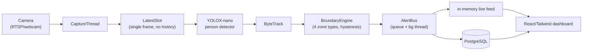
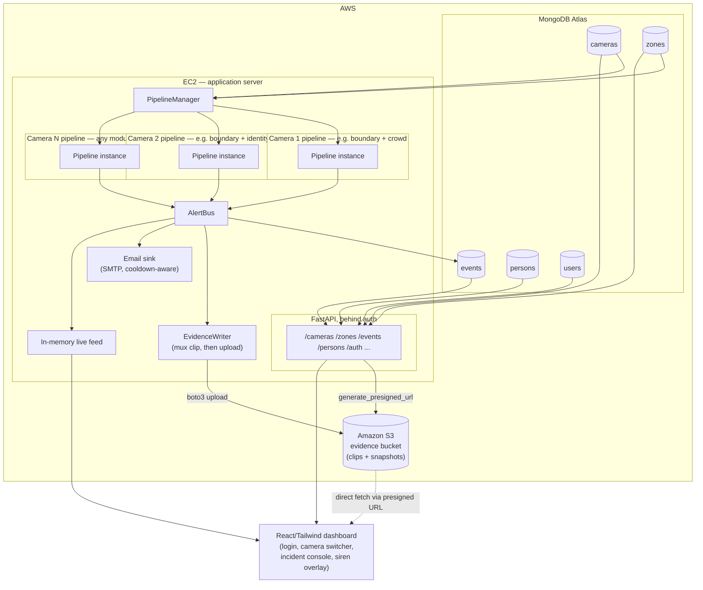
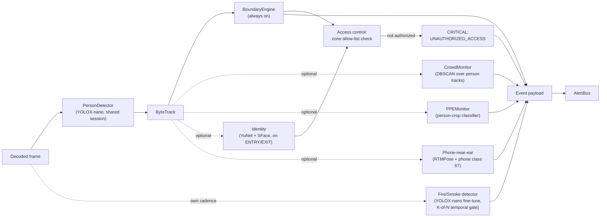
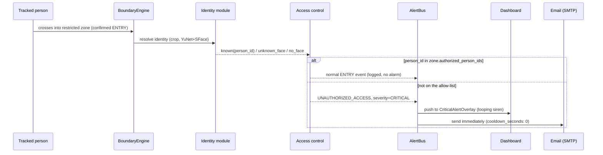
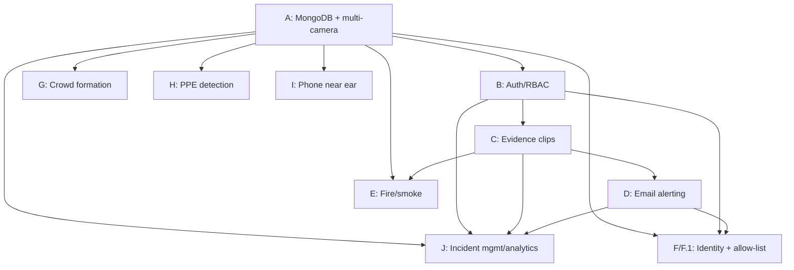

# Multi-Module Surveillance Platform — Expansion Plan

*Fire, Smoke & Boundary Detection → multi-camera, multi-module AI video surveillance platform*

- **Document version:** 1.0
- **Date:** 12 September 2026
- **Status:** approved for implementation, phases not yet started
- **Companion documents:** `PLAN.md` (original v1 scope, Revision 2), `README.md`, `NOTICE.md`,
  `video-surveillance-platform-solution-approach.md`, `detection-model-research-and-licensing.md`
- **Supersedes:** `PLAN.md` §1's "explicit non-goals (v1)" for PPE, crowd formation, and phone-near-ear
  detection. Weapon detection remains **out of scope** — it is not part of this platform.
- **Commercial:** confirmed — this product is sold to customers. Every model and library choice in this
  document is filtered through the same permissive-licence constraint `PLAN.md` established (MIT /
  Apache-2.0 / BSD / CC0 only; no AGPL/GPL, no paid enterprise licence).
- **Infrastructure:** the application server runs on AWS (EC2); the database is **MongoDB Atlas**
  (managed, not self-hosted); video clips and snapshots are stored in **Amazon S3**, served to the
  dashboard via short-lived **presigned URLs** rather than proxied through the API server. Atlas and S3
  are paid infrastructure/hosting costs, not embedded-software licences — they don't reopen the
  AGPL/SSPL redistribution concern the licence constraint above is about, since nothing from either is
  bundled into the shipped product.

---

## Table of contents

1. [Executive summary](#1-executive-summary)
2. [Current state (baseline)](#2-current-state-baseline)
3. [Scope of this expansion](#3-scope-of-this-expansion)
4. [Target architecture](#4-target-architecture)
5. [Model inventory — what runs where, and why](#5-model-inventory--what-runs-where-and-why)
6. [Data model](#6-data-model)
7. [Vector database decision](#7-vector-database-decision)
8. [Security, privacy and compliance](#8-security-privacy-and-compliance)
9. [Alerting and evidence pipeline](#9-alerting-and-evidence-pipeline)
10. [Phased implementation plan](#10-phased-implementation-plan)
11. [Risk register](#11-risk-register)
12. [Sequencing and dependencies](#12-sequencing-and-dependencies)
13. [Glossary](#13-glossary)

---

## 1. Executive summary

This platform today does three things reliably: it watches one camera, tracks the people in it, and
raises an alert when someone crosses a configured boundary. That is a solid, professionally-built
foundation — CPU-only inference, a licence-clean dependency stack, a rules engine with real hysteresis
logic, and a working dashboard — but it is one camera, one detection capability, and one operator
persona (a commissioning technician, not a security team).

This document plans the expansion of that foundation into a **multi-camera, multi-module** platform:
every camera an operator adds can independently run any combination of six capabilities (boundary
intrusion, crowd formation, PPE compliance, phone-near-ear, fire/smoke, and identity/face recognition),
zones gain a **restricted-access allow-list** that turns an unrecognised entrant into a critical,
audibly-alarmed, immediately-emailed incident, every alert carries a **video clip and snapshot** as
evidence, and the system moves onto **MongoDB** as its single datastore with a real login and role
system in front of it. Weapon detection is explicitly excluded.

Nothing here is aspirational hand-waving disconnected from the code: every module below either extends
a mechanism that already exists in this codebase (the boundary engine's hysteresis pattern, the
`AlertBus`'s queue-plus-background-thread shape, the `YoloxOnnx` wrapper already written to be
model-agnostic) or fills in a config key that has been sitting unused since an earlier phase (fire/smoke
cadence, identity thresholds, evidence file-path columns). Section 10 sequences the work into ten phases;
Section 5 is the model reference this document was specifically asked to produce.

## 2. Current state (baseline)

| Layer | Today | Verified? |
|---|---|---|
| Capture | RTSP / webcam / file, single camera, OpenCV + NVDEC-free CPU decode | Yes |
| Person detection | YOLOX-nano, ONNX Runtime, CPU, COCO-pretrained, filtered to `person` | Yes |
| Tracking | ByteTrack (Roboflow `trackers`, Apache-2.0) | Yes |
| Boundary rules | 4 zone types (polygon, tripwire, exclusion, fire-ROI), entry/exit hysteresis, schedules | Yes |
| Alerting | In-process `AlertBus`, PostgreSQL persistence, in-memory live feed | Yes |
| Fire & smoke | Config keys and cadence reserved; **no detector wired in** | No — scaffold only |
| Identity (face) | Schema columns and threshold reserved; **no detector wired in** | No — scaffold only |
| Video evidence | `snapshot_path`/`clip_path` columns exist; **nothing ever writes them** | No — scaffold only |
| Alert sinks | `AlertBus.sinks` list exists; **empty, nothing populates it** | No — scaffold only |
| Auth | **None** — the API and dashboard are open to anyone who can reach the host | No |
| Multi-camera | **No** — one `.env`, one `Pipeline`, one camera | No |
| PPE / crowd / phone-near-ear | Explicitly listed as v1 non-goals in `PLAN.md` §1 | No |
| Weapon detection | Not part of this platform | Out of scope |

## 3. Scope of this expansion

Numbering follows the scope items already used in `video-surveillance-platform-solution-approach.md`
for traceability back to that document.

| # | Capability | In this expansion? | New model required? |
|---|---|---|---|
| 1 | Multi-camera integration and per-camera module selection | **Yes — foundational (Phase A)** | No |
| 2 | Person detection and tracking | Already done | No |
| 3 | Unauthorized gathering / crowd formation | **Yes (Phase G)** | No |
| 4 | Weapon detection | **Excluded — not part of this platform** | — |
| 5 | Fire and smoke detection | **Yes (Phase E)** | Yes — fine-tune |
| 6 | Restricted area intrusion | Already done; **extended with an allow-list (Phase F.1)** | No |
| 7 | PPE / safety equipment detection | **Yes (Phase H)** | Yes — fine-tune |
| 8 | Mobile phone near ear in restricted zones | **Yes (Phase I)** | Yes — pretrained, no training run |
| 9 | Zone configuration and management | Already done; **moves to MongoDB (Phase A.3)** | No |
| 10 | Incident classification and severity | Already done via the boundary engine's severity mapping | No |
| 11 | Snapshot and video clip capture | **Yes (Phase C)** | No |
| 12 | Secure evidence storage | **Yes (Phase C)**, filesystem + MongoDB path references | No |
| 13 | Real-time alerting (email) | **Yes (Phase D)** | No |
| 14 | Centralized dashboard | Already done; **extended per phase** (cameras, incidents, persons) | No |
| 15 | Incident history and search | Already done (`AlertHistory`); **becomes an incident console (Phase J)** | No |
| 16 | Configurable rules and thresholds | Already done (`app.yaml`, zone config) | No |
| 17 | User and role management | **Yes (Phase B)** — two roles, not full enterprise RBAC | No |
| 18 | Reporting and analytics | **Yes, basic (Phase J)** | No |
| 19 | Camera health monitoring | Already done (feed heartbeat, disconnect detection) | No |
| 20 | Identity / face recognition and access control | **Yes (Phase F, F.1)** | No — pretrained |

## 4. Target architecture

### 4.1 System level — multi-camera

### 4.2 Per-camera pipeline — module composition

Each `Pipeline` instance only builds the components its camera's `enabled_modules` lists. Person
detection and tracking are the one always-on dependency, since every other module consumes person
tracks or reuses the same loaded detector session.

### 4.3 Unauthorized-access flow (the allow-list feature)

## 5. Model inventory — what runs where, and why

This is the reference table this document was specifically written to provide: every model in the
platform, what it is used for, what it's built on, its licence, and its status in this plan.

| Module | Model | Basis / architecture | Licence | Status | Purpose |
|---|---|---|---|---|---|
| Person detection | **YOLOX-nano** | Megvii YOLOX, ONNX, 416×416, CPU | Apache-2.0 | **In production** | Shared detection backbone every other module consumes track/box data from |
| Tracking | **ByteTrack** | Roboflow `trackers` (clean-room reimplementation) | Apache-2.0 | **In production** | Persistent track IDs, occlusion tolerance, feeds the boundary/crowd/PPE/phone/identity modules |
| Boundary intrusion | *(rules only — no model)* | Ground-point-in-polygon / tripwire-side geometry | — | **In production** | Zone entry/exit from tracked person positions |
| Crowd formation | *(rules only — no model)* | DBSCAN over `scipy.spatial.cKDTree` on person foot-points | — | Phase G | Distinguish a genuine huddle from people incidentally spread across a wide zone |
| Fire & smoke | **YOLOX-nano (fine-tuned)** | Same architecture/wrapper as the person detector, new weights + class map | Apache-2.0 (code); training data licence tracked per dataset in `NOTICE.md` | Phase E — model training is a parallel, separately-timed workstream | Detect flame/smoke regions; a K-of-N temporal gate (not raw per-frame confidence) turns detections into alerts |
| PPE detection | **New lightweight classifier (fine-tuned)** | Person-crop, region-constrained multi-label model, trained on SH17 + Construction-PPE | Apache-2.0 (code); dataset licences confirmed before training per `NOTICE.md` process | Phase H — model training is a parallel workstream | Helmet/vest/gloves/shoes/glasses per zone requirement, with an explicit "indeterminate" state |
| Phone near ear (object) | **YOLOX-nano (existing weights, no retrain)** | Same COCO-pretrained weights already loaded for person detection, filtered to class 67 (`cell phone`) instead of class 0 | Apache-2.0 | Phase I — software only, zero new training | Phone bounding boxes, fused with pose geometry |
| Phone near ear (pose) | **RTMPose** | OpenMMLab, ONNX-exportable | Apache-2.0 | Phase I — pretrained, no training run | Wrist/elbow/ear keypoints, run only on tracked persons in phone-restricted zones |
| Identity — face detection | **YuNet** | OpenCV Zoo | MIT | Phase F — pretrained | Locate a face within the top ~35% of a person box ≥120px tall |
| Identity — face recognition | **SFace** | OpenCV Zoo | Apache-2.0 | Phase F — pretrained | 128-d embedding, matched by cosine similarity (threshold 0.363) against the enrolled gallery |
| Access control (allow-list) | *(rules only — consumes identity output)* | Zone-scoped allow-list check on top of the identity match | — | Phase F.1 | Anyone not positively matched to a zone's `authorized_person_ids` is `UNAUTHORIZED_ACCESS`, critical severity, unconditionally |
| Weapon detection | *(not implemented)* | — | — | **Explicitly excluded** | Out of scope for this platform |

**Why no transformer detectors (RF-DETR/D-FINE) despite the licensing research recommending them:**
every model above runs CPU-only, no GPU assumed. The research document's preferred Apache-2.0
detectors are GPU/TensorRT-oriented; on CPU, YOLOX-nano's throughput (measured in this repo at ~39 FPS
fp32 @ 416px) is the better fit, and it is what the rest of the pipeline (tracker cadence, hysteresis
timing) is already tuned around. If GPU hardware is added to a future deployment tier, this is the
component to revisit — nothing else in the architecture depends on the choice of detector family.

**Why not scikit-learn for crowd DBSCAN:** the codebase already depends on `scipy` for geometry; DBSCAN
over a KD-tree neighbour query is a small, testable amount of code, and adding a full ML library for one
clustering algorithm doesn't match the deliberately minimal dependency footprint the rest of this project
keeps (the same reasoning that ruled out Ultralytics/AGPL tooling in the original `PLAN.md`).

## 6. Data model

All operational data moves to **MongoDB Atlas** (managed, hosted on AWS), accessed synchronously via
**PyMongo** (matching the codebase's existing all-synchronous threading model — no asyncio is
introduced) over an `mongodb+srv://` connection string. Atlas's own network access controls (IP
allowlist or VPC peering to the EC2 app server) replace the "who can reach the database" question a
self-hosted instance would otherwise need firewall rules for, and encryption at rest is handled by
Atlas rather than something this project has to configure itself.

| Collection | Purpose | Key fields |
|---|---|---|
| `cameras` | Camera registry, replacing the single `.env`-configured camera | `id, name, source_type, source, rtsp_url, substream, width, height, fps, decode_fps, autostart, enabled_modules[]` |
| `zones` | Per-camera zone definitions, replacing `zones.yaml` | `id, camera_id, type, points, name, detect[], events[], direction, min_frames, schedule, severity, applies_to[], conf_delta, authorized_person_ids[], crowd_threshold, ppe_required[], phone_restricted` |
| `events` | Incident/alert history, replacing the PostgreSQL `events` table | `ts, camera_id, kind, subtype, zone_id, track_id, message, severity, confidence, bbox, foot_point, person_id, identity_status, identity_name, snapshot_path, clip_path, status, assignee, notes[]` — `snapshot_path`/`clip_path` hold **S3 object keys** (e.g. `clips/cam_01/2026-09-12/<event_id>.mp4`), not local filesystem paths |
| `persons` | Face-recognition gallery | `id, name, external_id, active, embedding[]` (128-d SFace vector, see §7) |
| `users` | Login accounts | `email, password_hash, role ("admin"\|"operator"), active` |

Design choices carried over deliberately from the current PostgreSQL implementation: the `Database`
class's public method contract (`insert_event`, `recent_events`, `event_counts`, `zone_entry_counts`,
`healthy`, `purge_older_than`) stays the same shape so `AlertBus` and the API routes barely change under
the migration; `ZoneStore`'s public shape (`zones()`, `save()`, `version`, `last_error`) stays the same so
`BoundaryEngine` and the zone-editor UI barely change either. Only the persistence backend underneath
moves.

## 7. Vector database decision

**Not needed for this plan.** The only similarity-search-shaped feature in scope is the identity
gallery (§5, §6): a few dozen to a few hundred 128-d SFace embeddings per site. Brute-force cosine
similarity over that many vectors, done in NumPy, is sub-millisecond — there is no scale or latency
problem an approximate-nearest-neighbour index would solve. Nothing else in this plan does open-ended
visual similarity search or cross-camera re-identification (the original `PLAN.md` explicitly excludes
multi-camera re-id as a non-goal, and this plan does not reopen that).

Since the plan now runs on **MongoDB Atlas** (§6), native `$vectorSearch` is actually available without
standing up any new infrastructure — but the recommendation doesn't change. A few hundred embeddings
don't benefit from an ANN index either way, and reaching for a paid Atlas feature (Atlas Search/Vector
Search tiers carry their own cost and indexing overhead) to solve a problem plain NumPy already solves
for free adds coupling with no measurable benefit at this scale. A dedicated external vector database
(Qdrant, Milvus, Chroma) would be even less justified — a new service to deploy, secure, and back up for
a few hundred vectors.

**Recommendation:** store each person's embedding as a plain float array field on their `persons`
document; rebuild an in-memory NumPy matrix on startup and on enrollment/removal; do nearest-neighbour
lookup with plain matrix multiplication. **Revisit this only if** the identity gallery grows into the
thousands (e.g. badge-linked enrollment across many sites) or a genuinely new feature needs open-ended
visual similarity search — at that point Atlas's built-in `$vectorSearch` is the natural next step
(no new infrastructure to add, since Atlas is already the database), ahead of standing up a separate
service like Qdrant.

## 8. Security, privacy and compliance

- **Authentication:** login required for every route; httpOnly, secure, signed session cookie rather than
  a JWT held in browser JS — this removes the XSS-token-theft risk class for what is fundamentally a
  control-room dashboard rather than a public API.
- **Authorization:** two roles — `admin` (full read/write, including camera credentials, zone
  configuration, person enrollment, user management) and `operator` (read/acknowledge, no configuration
  changes). This is intentionally simpler than the full Super-Admin/Site-Admin/Auditor hierarchy described
  in the reference solution document; it can be extended later without a redesign, since every mutating
  route already runs through a single `require_role()` dependency.
- **Credential handling:** RTSP credentials move from `.env` (one camera) to per-camera MongoDB documents
  (many cameras) — never echoed back over the API in full, matching today's redact-on-read behaviour;
  access to camera documents is `admin`-only.
- **Biometric data (identity module):** disabled by default; enrollment and removal are `admin`-only
  actions; a person can be deleted by name, which also purges their embedding; retention policy
  (`storage.retention_days`) applies to any stored reference imagery. This follows the same compliance
  posture `PLAN.md` §10 already established for DPDP Act 2023 / GDPR Art. 9 / BIPA-class obligations.
- **Evidence access (S3):** the evidence bucket is private (no public access, blocked at the bucket-policy
  level); the API only ever hands out a **presigned URL** (short expiry — minutes, not hours) after
  checking the requesting user is authenticated, so a clip is never reachable by a guessed or shared S3
  URL once that URL expires; server-side encryption (SSE-S3 or SSE-KMS) is enabled on the bucket.
- **AWS credentials:** the EC2 application server authenticates to S3 via an **IAM instance role**, not
  static access keys — this means no AWS credential ever needs to live in `.env` at all, which is a
  strictly better position than the RTSP-credential handling described above (there is simply nothing to
  redact or leak). Static keys remain a fallback only for local development off AWS.
- **Licensing:** every model and library in §5 is permissive (MIT/Apache-2.0) or a pretrained model with
  a commercially-usable licence; no AGPL/GPL component enters the dependency tree, matching the licence
  gate that already runs in this repo's CI (`tools/check_notice.py`, `pip-licenses`, `npm run licences`).
  `boto3` (Apache-2.0) is the one new dependency this infrastructure choice adds.

## 9. Alerting and evidence pipeline

Every alert, regardless of module, goes through the same path: `Pipeline` → `AlertBus` →
(`events` collection + `EvidenceWriter` + configured sinks). This is deliberate — a new detection module
never needs its own alerting or evidence code, only a call into the existing `AlertBus.publish()`.

- **Evidence capture:** a rolling ring buffer of recent JPEG-encoded frames (config: 15s pre-roll) feeds
  an `EvidenceWriter` background thread, which on any published alert muxes a pre+post-event MP4 clip and
  captures an annotated snapshot at peak confidence into a local temp file (`cv2.VideoWriter` has no
  direct-to-S3 mode), uploads both to the S3 evidence bucket via `boto3`, deletes the local temp file, and
  writes the resulting **S3 object keys** back onto the event document's `snapshot_path`/`clip_path`
  fields. The upload happens on the same background thread as the muxing — never on the inference
  hot path — so a slow or momentarily unreachable S3 endpoint degrades evidence latency, not detection.
- **Serving evidence:** `GET /api/events/{id}/clip` and `/snapshot` don't stream the file themselves —
  they look up the stored S3 key, call `generate_presigned_url`, and redirect the browser to it, so the
  API server never proxies clip bandwidth and the object stays private otherwise.
- **In-app alerting:** a persistent, non-auto-dismissing overlay for critical events (fire/smoke,
  unauthorized access), including a looping audible siren via the Web Audio API that runs until an
  operator acknowledges it.
- **Email alerting:** SMTP-based, routed and throttled by a configurable `min_severity` /
  `cooldown_seconds` rule per sink entry — `cooldown_seconds: 0` is how unauthorized-access alerts bypass
  throttling entirely, since a security-critical, rare event should never be silently suppressed by a
  cooldown meant for routine boundary crossings.

## 10. Phased implementation plan

Each phase is independently shippable and testable. Phases E, G, H, and I add genuinely new detection
capability and each carries its own model/dataset workstream, flagged explicitly — training or sourcing
a model has its own timeline, separate from the software-integration work that ships around it.

| Phase | Name | Key deliverables | New model? |
|---|---|---|---|
| **A** | MongoDB migration + multi-camera architecture | `cameras`/`zones`/`events` collections; `PipelineManager` running one `Pipeline` per camera with per-camera module selection | No |
| **B** | Auth & RBAC | Login, session cookies, `admin`/`operator` roles enforced on every mutating route | No |
| **C** | Video evidence | Ring buffer, `EvidenceWriter` (mux + S3 upload via `boto3`), presigned-URL clip/snapshot routes, playback in the dashboard | No |
| **D** | Email alerting | SMTP sink, per-rule severity/cooldown routing | No |
| **E** | Fire & smoke detection | Fine-tuned detector + K-of-N temporal gate + zone (fire-ROI/exclusion) integration | Yes — fine-tune |
| **F / F.1** | Identity + restricted-zone allow-list | YuNet+SFace pipeline, enrollment UI, allow-list enforcement, critical alarm + immediate email on violation | No — pretrained |
| **G** | Crowd formation | `CrowdMonitor` (DBSCAN on tracked persons), per-zone thresholds | No |
| **H** | PPE detection | Person-crop, region-constrained multi-label detector, per-zone/per-item requirements | Yes — fine-tune |
| **I** | Phone near ear | Pose + phone-class geometry fusion, per-zone opt-in | Yes — pretrained only |
| **J** | Incident management & analytics | Status/assignee/notes workflow, basic analytics dashboard | No |

*(Full task-level detail — exact files touched, function signatures to preserve, test strategy per phase
— is tracked in the engineering plan used to drive implementation; this document is the architectural and
model-selection reference for that work.)*

## 11. Risk register

| Risk | Impact | Mitigation |
|---|---|---|
| Fine-tuned models (fire/smoke, PPE) underperform on site footage before training data is collected | Delayed rollout of those two modules specifically | Software integration ships independent of model readiness (testable with stub weights); per-module go-live gated on measured recall/precision, not on the phase's code being merged |
| CPU-only inference limits how many modules run simultaneously per camera | Frame-rate degradation on cameras with many modules enabled | Per-camera module selection (Phase A) lets low-priority cameras run fewer modules; identity/phone/PPE already scoped to run only on tracked persons inside relevant zones, not every frame |
| Multi-camera credential storage in MongoDB is a larger attack surface than one `.env` file | Camera/RTSP credential exposure if the database or an admin account is compromised | Admin-only access to camera documents, redact-on-read, auth required for every route (Phase B) before camera CRUD ships |
| Web Audio siren requires an open browser tab and a prior user gesture to unlock autoplay | A critical alert could go unheard if no operator is actively viewing the dashboard | One-time "enable alerts" prompt on login; email alerting (Phase D) is the independent, always-on backstop channel |
| Biometric (face) data handling | Regulatory exposure (DPDP/GDPR/BIPA) | Disabled by default, admin-only enrollment/removal, deletable by name, retention policy enforced — per `PLAN.md` §10 |
| EC2 ↔ Atlas / EC2 ↔ S3 network dependency | Evidence writes or database access degrade if outbound AWS connectivity is impaired | `EvidenceWriter` upload runs off the inference hot path (detection keeps working even if S3 upload is slow/queued); Atlas/S3 both sit in the same AWS region as the EC2 instance to minimize latency and exposure to public internet path issues |
| Atlas is a paid managed service | Ongoing hosting cost and a vendor dependency, distinct from the software-licence constraints elsewhere in this document | Accepted trade-off for reduced operational burden (no self-managed DB patching/backups); `PLAN.md`'s "no paid enterprise licence" constraint is about embedded software licences (AGPL/SSPL), not hosting costs, so this doesn't violate it |

## 12. Sequencing and dependencies

Phases E, F, G, H, and I are independent of each other once A–D are complete, and can be built in any
order or in parallel; the sequence above reflects how ready the existing codebase already is for each —
fire/smoke and identity have config and schema waiting, crowd needs no model at all, and PPE requires the
most net-new data work.

## 13. Glossary

| Term | Meaning |
|---|---|
| ONNX | Open Neural Network Exchange — the portable model file format used for every detector in this platform |
| ANN | Approximate Nearest Neighbour — the search technique a vector database provides; not needed here (§7) |
| DBSCAN | Density-Based Spatial Clustering of Applications with Noise — the clustering algorithm used to distinguish a crowd from spread-out people |
| ByteTrack | The multi-object tracking algorithm used to give each detected person a persistent ID across frames |
| Hysteresis (in this codebase) | A confirm-after-N-consecutive-observations pattern used to avoid firing on a single flickering detection |
| Cosine similarity | The distance metric used to compare a face embedding against enrolled identities |
| RTSP | Real Time Streaming Protocol — the standard camera-stream transport this platform ingests |
| K-of-N gate | A temporal confirmation rule: an alert fires only once a signal has appeared in at least K of the last N inference frames |
| Presigned URL | A time-limited URL that grants temporary access to a private S3 object without making the bucket public |
| IAM role | An AWS identity an EC2 instance can assume to call AWS services (e.g. S3) without storing static access keys anywhere |
